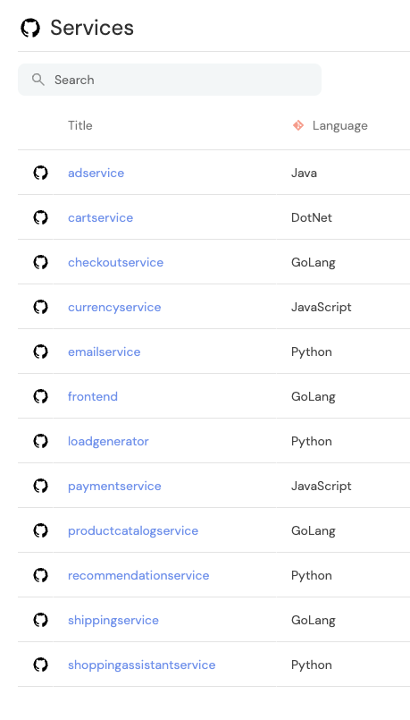
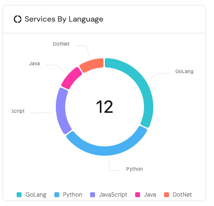
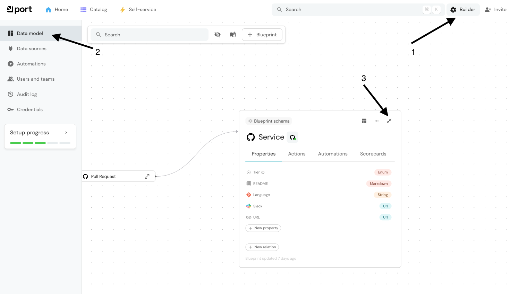

# Adding Programming Language to Your Software Catalog

In this guide, we will add programming language detection to your software catalog, so that each service will have a programming language property corresponding to the language used in the service.

End result:

<div style="display: flex; gap: 20px; align-items: center; justify-content: center;">
    
    
</div>

## Understanding the Basics

There are only three words you need to know to understand how to add programming language detection to your software catalog: **Blueprint**, **Mapping**, and **Entity**.

**Blueprints** are the schema of your **Entities**. They define the structure of your entities, for example, what properties and relationships an entity can have, just like a class definition in a programming language or a table schema in a database.

**Mappings** are the rules that tell Port how to extract and transform data from your sources (like Git repositories) into Port **Entities**.

## Step-by-Step Implementation

### Step 1: Create a Blueprint

In this example, a blueprint was created automatically when you chose GitHub as your source.

You can examine the blueprint created by clicking on the `Builder` button on the top-right (or [here](https://app.getport.io/settings/data-model)) and then clicking on `Data model` and expanding the `service` blueprint.



### Step 2: Creating JavaScript Language Mappings

Let's start by creating a JavaScript detection mapping.

Add the following mapping to the GitHub mapping you created in the [Getting Started Guide](GETTING-STARTED.md).

Click on the `Builder` button on the top-right and then click on `Data sources`. Click to open the `Github` data source configuration.
In the bottom-left `Mapping` section, add the following mapping to the end of the YAML file:

**JavaScript Detection**

```yaml
- kind: file
selector:
  query: "true"
  files:
  - path: src/*/package.json
    repos:
    - microservices-demo
port:
  entity:
    mappings:
      identifier: .file.path | split("/") | .[1]
      blueprint: '"service"'
      properties:
        language: '"JavaScript"'
```

Then click on `Save & Resync`.

**This mapping looks for package.json files in service directories to identify JavaScript/Node.js services.**

#### Line-by-line Understanding the Mapping Structure

Each mapping consists of:

- A file selector that specifies which files to look for
- A repository filter to limit the scope
- Entity mappings that:
  - Extract the service identifier from the file path, see below JQ expression details
  - Specify the blueprint type ("service")
  - Set the programming language property

The `.file.path | split("/") | .[1]` expression extracts the service name from paths like `src/<servicename>/package.json`.

This setup will automatically detect and set the programming language for each service based on the presence of language-specific files in their directories.

Of course, you can change the language name to `'NodeJS'` to `'TypeScript'` or any other language name.

### Step 3: Creating Other Language Mappings

You can create similar mappings for Python, GoLang, DotNet and Java by adding the following mapping to the GitHub mapping you created in the [Getting Started Guide](GETTING-STARTED.md).

```yaml
- kind: file
  selector:
    query: "true"
    files:
      - path: src/*/go.mod
        repos:
          - microservices-demo
  port:
    entity:
      mappings:
        identifier: .file.path | split("/") | .[1]
        blueprint: '"service"'
        properties:
          language: '"GoLang"'
- kind: file
  selector:
    query: "true"
    files:
      - path: src/*/requirements.txt
        repos:
          - microservices-demo
  port:
    entity:
      mappings:
        identifier: .file.path | split("/") | .[1]
        blueprint: '"service"'
        properties:
          language: '"Python"'
- kind: file
  selector:
    query: "true"
    files:
      - path: src/*/*.sln
        repos:
          - microservices-demo
  port:
    entity:
      mappings:
        identifier: .file.path | split("/") | .[1]
        blueprint: '"service"'
        properties:
          language: '"DotNet"'
- kind: file
  selector:
    query: "true"
    files:
      - path: src/*/build.gradle
        repos:
          - microservices-demo
  port:
    entity:
      mappings:
        identifier: .file.path | split("/") | .[1]
        blueprint: '"service"'
        properties:
          language: '"Java"'
```

## Further Reading

To fully understand above mappings, you can read the following guides:

- [Configure Mapping](https://docs.getport.io/build-your-software-catalog/customize-integrations/configure-mapping/)
- [Setup Blueprint](https://docs.getport.io/build-your-software-catalog/customize-integrations/configure-data-model/setup-blueprint/)
- [Relate Blueprints](https://docs.getport.io/build-your-software-catalog/customize-integrations/configure-data-model/relate-blueprints/)
