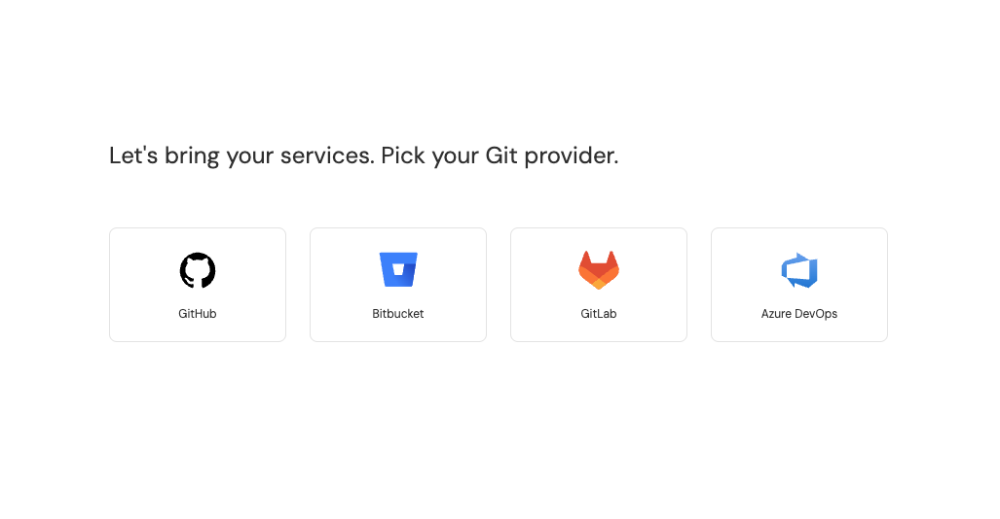
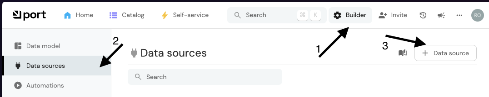
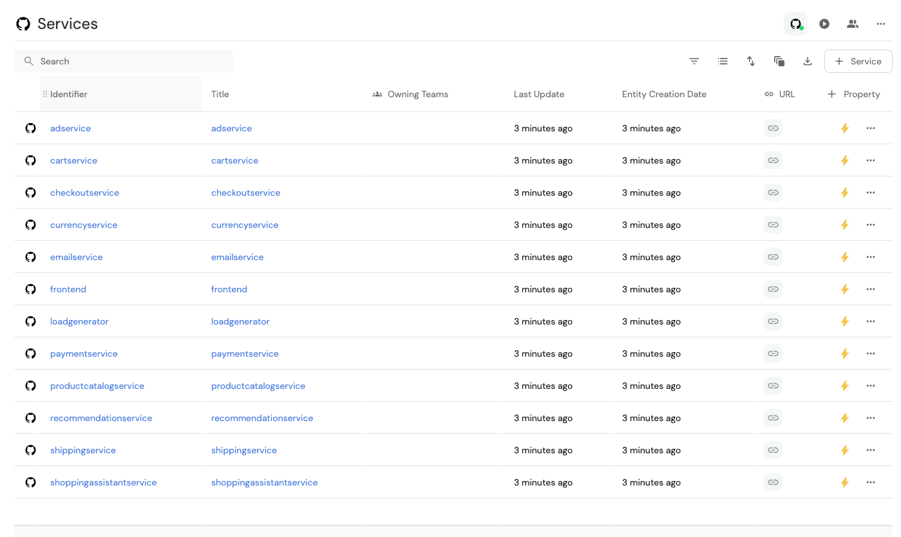
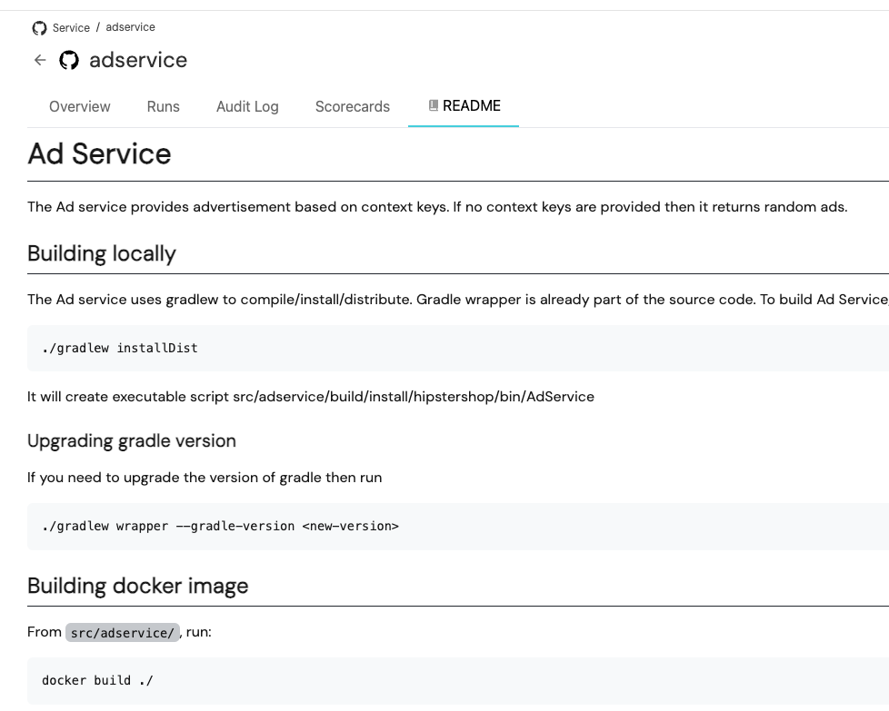
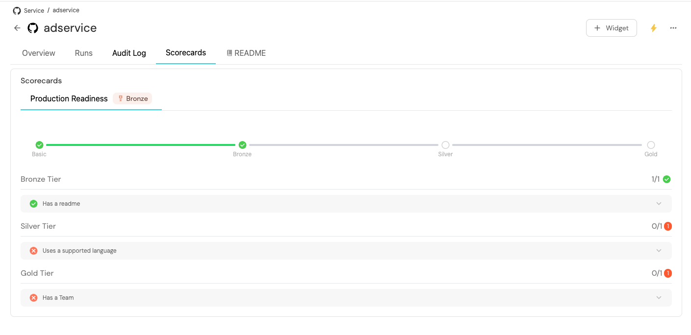

# Getting Started with Port 🚀

This guide will help you set up a service catalog for your microservices using Port.

## Prerequisites

1. 🔄 Fork the demo repository: https://github.com/port-labs/microservices-demo/tree/main
   - If you rename the repository, be sure to note the new name for later steps
2. ✨ Create a free Port account at https://app.getport.io/signup
3. ✉️ Verify your email address

## Setting Up GitHub Integration

### Option 1: Automatic Setup

1. In this example, we'll use GitHub as our integration source.
   

1. Select GitHub as your integration source
1. Install the Port GitHub app and grant permissions for your forked repo

### Option 2: Manual Setup

If automatic setup doesn't work:

1. Click the `Builder` button in the top right
2. Select `Data sources` from the left sidebar
3. Click `New data source`



## Configuring the Monorepo Integration

1. Navigate to [Data Sources](https://app.getport.io/settings/data-sources) or click the `Builder` button in the top right and select `Data sources` from the left sidebar
2. Locate your GitHub integration under `Exporters`
   
3. Click on the card or click the `three dots` menu → `Edit`
4. Add the following configuration to the `Mapping` section on the bottom-left:

```yaml
resources:
  - kind: folder
    selector:
      query: "true"
      folders:
        - path: src/* # Relative path to the folders within the repositories.
          repos: # List of repositories to include folders from.
            - microservices-demo
    port:
      entity:
        mappings:
          identifier: ".folder.name"
          title: ".folder.name"
          blueprint: '"service"'
          properties:
            url: .repo.html_url + "/tree/" + .repo.default_branch  + "/" + .folder.path
            readme: file://README.md
```

> [!IMPORTANT]  
> If you renamed your repository after forking, make sure to update the `microservices-demo` value under `repos:` in the mapping configuration above to match your new repository name.

5. Click `Save & Resync` and wait for synchronization to complete

## Viewing Your Service Catalog

Once synced, you can access your service catalog at https://app.getport.io/services, where you'll find:

1. **Service List View**
   

2. **Individual Service Pages** with documentation
   

3. **Service Scorecards** for quality metrics
   
   Learn more about scorecards [here](https://www.getport.io/guide/scorecards)

## Next Steps

To enhance your service catalog with programming language information, proceed to:
[Adding Language Information](ADDING-LANGUAGE.md)
