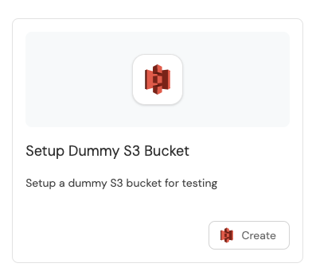

# Self Service Actions

Drive developer productivity by allowing developers to use self-service actions like scaffolding a service or provisioning a cloud resource. [Read more](https://docs.getport.io/actions-and-automations/create-self-service-experiences/)

Port's action model is designed to be flexible and can be used to cover a wide range of use-cases:

1. **Unopinionated** - flexible UI to create a wide range of self-service actions.
2. **Leverages existing infrastructure and automations** as the backend of your actions.
3. **Loosely coupled** to your infrastructure and architecture.
4. **Stateful** - every invoked action affects the software catalog by adding/modifying/deleting one or more entities.
5. **Secure by design** - does not require keys to sensitive infrastructure by using an event-based model. All actions are audited and can include guardrails like manual approval and TTL.

End result:

    
    

---

# Example - Call an external API

In this example, we'll create a self-service action that calls an external API from a GitHub Actions workflow.

## Prerequisites

Make sure you completed the [Getting Started](./GETTING-STARTED.md) guide.

## Create a self-service action

1. Go to the [Actions](https://app.getport.io/self-serve) page.
2. Click on the `+ Action` button.
3. Fill the Title, Description, and Icon as you see fit. For example:
   - Title: `Setup Dummy S3 Bucket`
   - Description: `Setup a dummy S3 bucket for testing`
   - Icon: Search for S3 icon
4. Make sure `Operation` is set to `Create`
5. Leave all other fields as default and hit `Next`.
6. Add two new user inputs to the action by clicking on the `+ Input` button twice.
   - add `Webhook URL` - Type `Text`
   - add `Payload` - Type `Text`
7. Hit `Next`.
8. Select the **Run Github workflow** backend.
   - Fill in `Organization` - The organization name you forked this repository into.
   - Fill in `Repository` - Probably `microservices-demo`, the repository name you forked this repository into.
   - Fill in `Worflow file name` - In this case `setup-dummy-s3-bucket.yml`, the workflow file name you want to run.
9. Hit `Next`.
10. Hit `Create`.

Congratulations! You should see the action in the UI and it should be similar to the images above.

## Test the action

For testing purposes, we will use the [webhook.site](https://webhook.site/) service to imitate an external API.

1. Go to [webhook.site](https://webhook.site/) and copy your unique URL.
2. Click on the action card you just created.
3. Fill in the `Webhook URL` and `Payload` fields.
   - Use the URL you copied from webhook.site.
   - Use the following payload: `"Hello, World!"`
4. Hit `Execute`.

You should see the action executed and the github workflow running in your repository.
After the workflow is finished, inside the webhook.site you should see the payload.

# Further reading

- [Self-Service Actions](https://docs.getport.io/actions-and-automations/create-self-service-experiences/)
- [Supported Backends for Self-Service Actions](https://docs.getport.io/actions-and-automations/setup-backend/)
